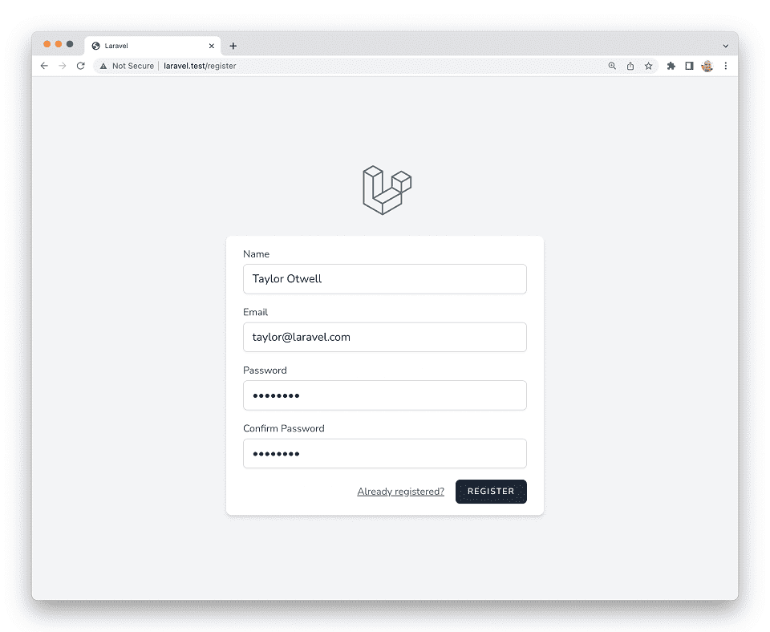

# Laravel 9 · Стартові компоненти

- [Вступ](#introduction)
- [Laravel Breeze](#laravel-breeze)
  - [Встановлення](#laravel-breeze-installation)
  - [Breeze и React / Vue](#breeze-and-inertia)
  - [Breeze и Next.js / API](#breeze-and-next)
- [Laravel Jetstream](#laravel-jetstream)

<a name="introduction"></a>

## Вступ

Щоб дати вам фору при створенні нового дадатку, Laravel пропонує стартові компоненти програми та, зокрема, автентифікації. Ці компоненти автоматично доповнять ваш додаток маршрутами, контролерами та шаблонами, необхідними для реєстрації та автентифікації користувачів вашого додатка.

Ви можете використовувати ці стартові компоненти, але вони необов'язкові. Ви можете створити власний додаток з нуля, просто встановивши нову копію Laravel. У будь-якому випадку, ми знаємо, що ви створите щось чудове!

<a name="laravel-breeze"></a>

## Laravel Breeze

[Laravel Breeze](https://github.com/laravel/breeze) – це мінімальна та проста реалізація всього [функціоналу аутентифікації](authentication.md) Laravel, включаючи вхід у систему, реєстрацію, скидання пароля, підтвердження адреси електронної пошти та пароля. Шар «View» комплекту Laravel Breeze за замовчуванням складається з простих [шаблонів Blade](blade.md),стилізованих за допомогою [Tailwind CSS](https://tailwindcss.com).

Breeze є чудовою відправною точкою для створення нового додатку Laravel, а також відмінний вибір для проектів, які планують вивести використання шаблонів Blade на новий рівень за допомогою [Laravel Livewire](https://laravel-livewire.com).



<a name="laravel-breeze-installation"></a>

### Встановлення

Спочатку ви маєте [створити новий додаток Laravel](installation.md), налаштувати свою базу даних та запустити [міграції бази даних](migrations.md):

```shell
curl -s https://laravel.build/example-app | bash

cd example-app

php artisan migrate
```

Створивши новий додаток Laravel, ви можете встановити Laravel Breeze за допомогою Composer:

```shell
composer update

composer require laravel/breeze --dev
```

Після того, як Composer встановить пакунок Laravel Breeze, можна запустити команду `breeze:install` Artisan. Ця команда опублікує шаблони, маршрути, контролери та інші ресурси автентифікації для вашого додатку. Laravel Breeze опублікує весь свій код у вашому додатку, щоб у вас був повний контроль, а також огляд всього функціонала та його реалізації. Після встановлення Breeze ви також повинні скомпілювати свої веб-активів, щоб був доступний файл стилів вашого додатку:

```shell
php artisan breeze:install

npm install
# Запустить сервер розробки Vite...
npm run dev

# Скомпілювати веб-активи для production...
npm run build

php artisan migrate
```

Далі, можна перейти у своєму веб-браузері за URL-адресами вашого додатка `/login` або `/register`. Усі маршрути Breeze визначено у файлі `routes/auth.php`.

> **Note**  
> Щоб дізнатися більше про компіляцію CSS та JavaScript вашого додатку, ознайомтеся з [документацією Laravel Vite](vite.md#configuring-vite).

<a name="breeze-and-inertia"></a>

### Breeze и React / Vue

Laravel Breeze також пропонує каркаси React та Vue через реалізацію зовнішнього інтерфейсу [Inertia.js](https://inertiajs.com). Inertia дозволяє створювати сучасні односторінкові додатки React та Vue, використовуючи класичну маршрутизацію та контролери на боці сервера.

Inertia дозволяє насолоджуватися потужністю зовнішнього інтерфейсу React і Vue у поєднанні з неймовірною продуктивністю Laravel. Щоб використовувати стек Inertia, вкажіть `vue` або `react` як бажаний стек при виконанні команди `breeze:install`Artisan:

```shell
php artisan breeze:install vue

# Або ...

php artisan breeze:install react

npm install
# Запустить сервер розробки Vite...
npm run dev

# Скомпілювати веб-активи для production...
npm run build
php artisan migrate
```

Якщо ви хочете, щоб Breeze підтримував [Inertia SSR](https://inertiajs.com/server-side-rendering), ви можете вказати параметр ssr при виклику команди `breeze:install`:

```shell
php artisan breeze:install vue --ssr
php artisan breeze:install react --ssr
```

<a name="breeze-and-next"></a>

### Breeze и Next.js / API

Laravel Breeze також може створити API-інтерфейс аутентифікації, готовий для аутентифікації сучасних програм JavaScript, наприклад, на базі [Next](https://nextjs.org), [Nuxt](https://nuxtjs.org) та інших. Для початку вкажіть стек `api` як бажаний при виконанні команди `breeze:install` Artisan:

```shell
php artisan breeze:install api

php artisan migrate
```

Під час встановлення Breeze додасть змінну середовища `FRONTEND_URL` у файл `.env` вашого додатка. Ця URL-адреса повинна бути URL-адресою вашої програми JavaScript. Зазвичай під час локальної розробки цією адресою буде `http://localhost:3000`.Крім того, ви повинні переконатися, що для вашого `APP_URL` встановлено значення `http://localhost:8000`, яке є URL-адресою за замовчуванням, яку використовує команда `serve` Artisan.

<a name="next-reference-implementation"></a>

#### Доступна реалізація Next.js

Тепер ви будете готові поєднати вказаний вище бекенд із вибраним вами інтерфейсом. Реалізація Next зовнішнього інтерфейсу Breeze доступна на [GitHub](https://github.com/laravel/breeze-next). Цей інтерфейс підтримується Laravel і містить той самий інтерфейс користувача, що й традиційні стеки Blade і Inertia, що надаються Breeze.

<a name="laravel-jetstream"></a>

## Laravel Jetstream

У той час як Laravel Breeze забезпечує просту та мінімальну відправну точку для створення додатка Laravel, Jetstream доповнює цю функціональність більш надійними функціями та додатковими стеками технологій клієнтського інтерфейсу. **Для тих, хто є новачком в Laravel, ми рекомендуємо вивчити основи роботи з Laravel Breeze перед тим, як перейти на Laravel Jetstream.**

Jetstream пропонує гарно оформлений каркас додатків для Laravel і включає вхід в систему, реєстрацію, підтвердження адреси електронної пошти, двофакторну автентифікацію, управління сесіями, підтримку API через Laravel Sanctum, та додатково управління командою. Jetstream розроблений з використанням [Tailwind CSS](https://tailwindcss.com) і пропонує на ваш вибір каркас клієнтського інтерфейсу під керуванням [Livewire](https://laravel-livewire.com) або [Inertia.js](https://inertiajs.com).

Повний опис встановлення Laravel Jetstream можна знайти в [офіційній документації Jetstream](https://jetstream.laravel.com).
